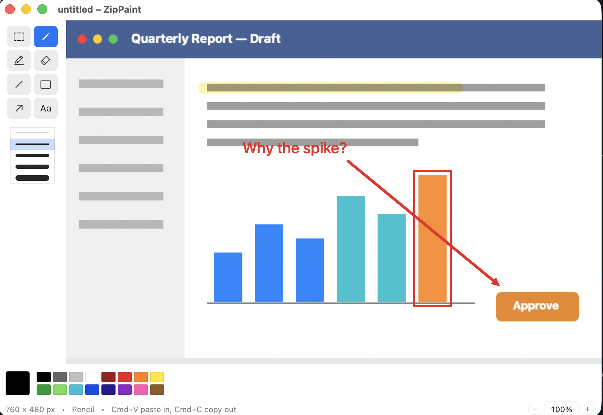

# ZipPaint — a tiny Paint for macOS

A very small, fast, native macOS app in the spirit of classic Windows Paint,
built for one workflow:

> **Paste a picture in → mark it up → Cmd+C → paste it anywhere.**



No document management, no layers, no filters. Just a canvas, a few marking
tools, and rock-solid clipboard support.

## Core workflow

1. Copy any image (screenshot, web image, photo).
2. Switch to ZipPaint and press **Cmd+V**. The canvas automatically resizes
   to exactly fit the pasted image.
3. Mark it up with the pencil, highlighter, eraser, shapes, or text.
4. Press **Cmd+C**. The whole marked-up canvas is now on the clipboard.
5. Paste into a web chat, email, document — anywhere that accepts images.

## Features (v1)

| Feature | Notes |
|---|---|
| Paste image (Cmd+V) | Canvas auto-sizes to the image; window resizes to fit |
| Pencil | Opaque freehand stroke, selectable color and width |
| Highlighter | Semi-transparent wide stroke that lets the image show through |
| Eraser | Removes markup strokes, revealing the original image underneath |
| Line / Rectangle / Arrow | Drag to draw; arrow is great for pointing at things |
| Text | Click to place a short label |
| Color palette | Small MS-Paint-style swatch grid |
| Stroke widths | Thin / medium / thick |
| Undo / Redo | Cmd+Z / Shift+Cmd+Z, per-stroke |
| Copy (Cmd+C) | Flattens image + markup and puts it on the clipboard |
| Save as PNG (Cmd+S) | Optional file export |
| Open image (Cmd+O) | Load an image file instead of pasting |

## Building and running

Requires Xcode (or the command line tools) with Swift 6.

```sh
./build.sh        # builds ZipPaint.app
open ZipPaint.app
```

## Project documents

- [SPEC.md](SPEC.md) — what the app does, in detail (requirements and decisions)
- [ARCHITECTURE.md](ARCHITECTURE.md) — how it's built (code structure, key techniques)
- [ROADMAP.md](ROADMAP.md) — build order and current status
